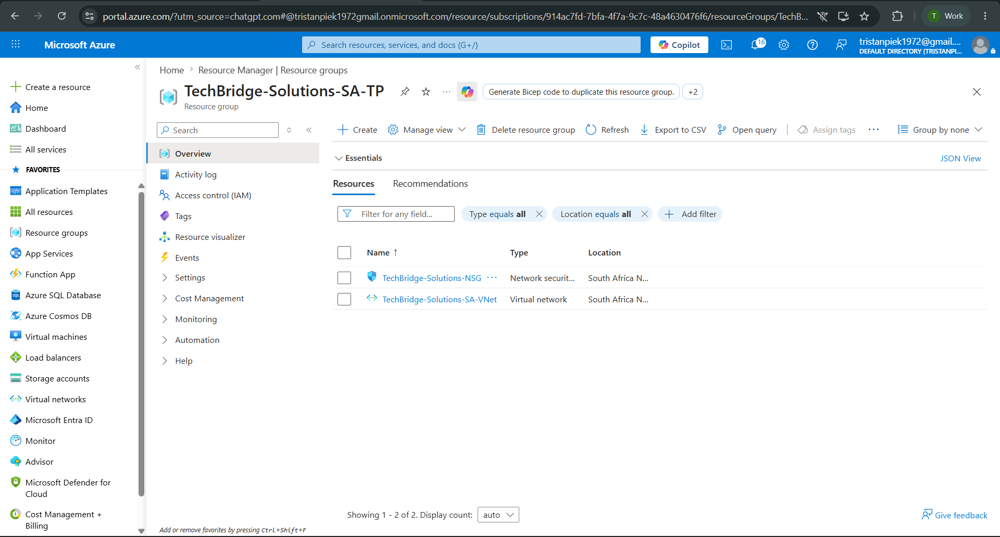
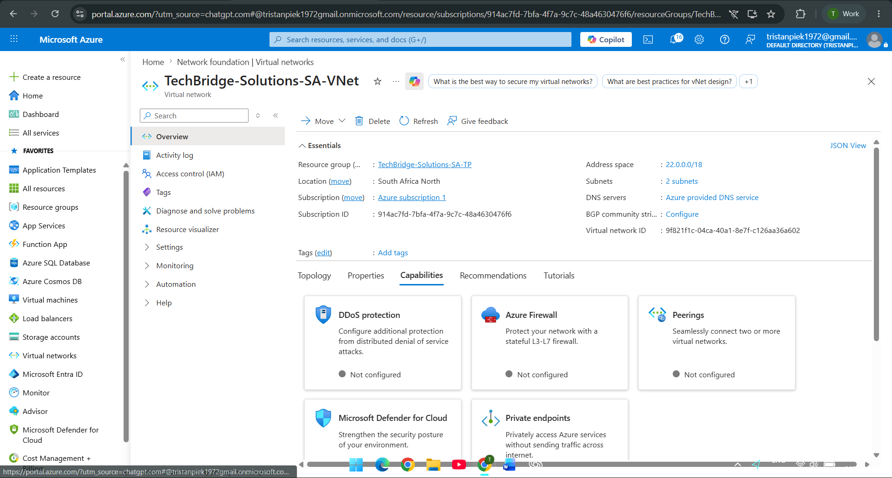
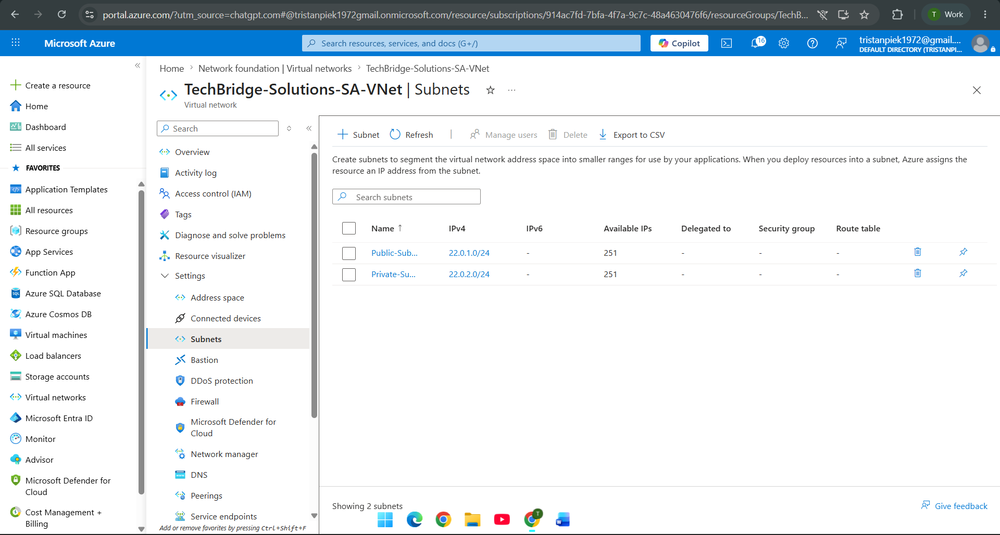
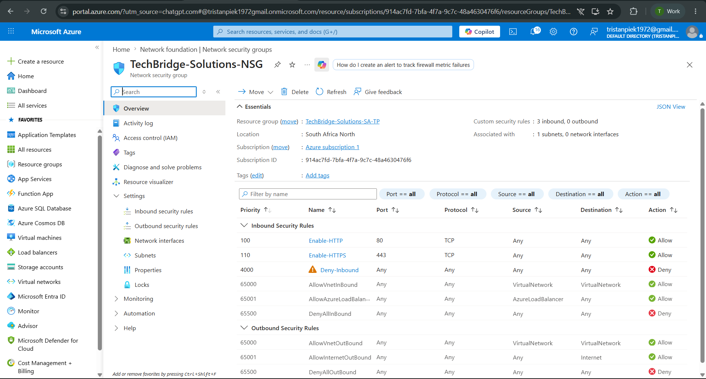
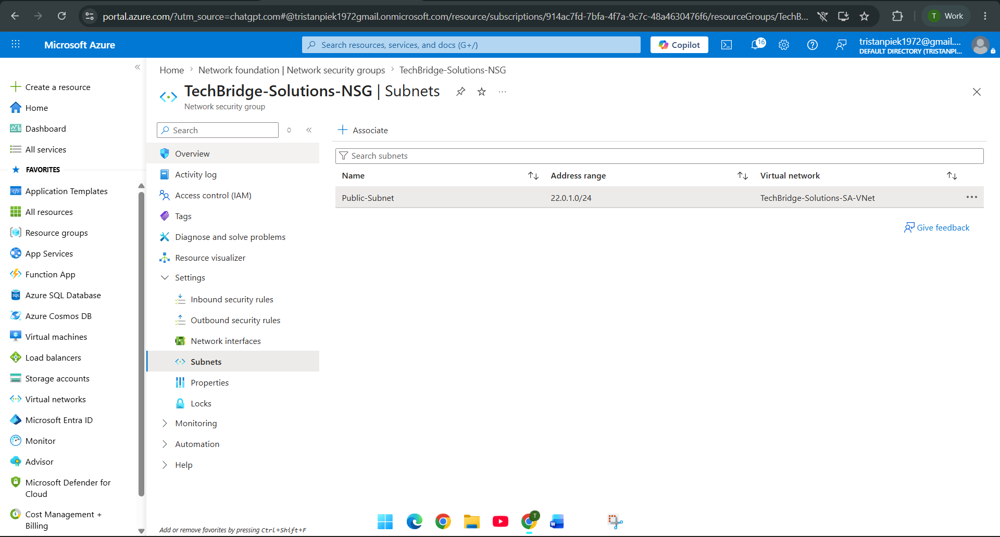

# NET731-Week2-20240476
This Repository is for my Week 2 NET practical. 

## Personal Information
Tristan Piek 

20240476

## TechBridge Solutions Scenario

a Small Business called TechBridge Solutions asked me to design and implement a cloud network architecture. I used Microsoft
Azure and created s suitable virtual network, subnets and network security groups (NSGs), and created rules to divide public
access from private access.

## Virtual Network Design

#### Component | Chosen Config.

VNet Name : TechBridge-Solutions-SA-VNet

Address Space : 22.0.0.0/18

Region : South Africa North 

#### Explanation for these choices

The 22.0.0.0/18 address space was chosen because it falls in the private IP range, there would be enough usable addresses
for the orinization for its current business requirements aswell as going forward and allows for further growth and subnet
expansion.

## Subnet Design

| Subnet Name | Address Range | Why I Chose these |

Public-Subnet   22.0.1.0/24   For hosting public services 

Private-Subnet   22.0.2.0/24   For hosting private backend systems  

### Explanation for these choices

I created two different subnets to seperate public resources from interfereing with private resources, this will in turn
improve network security and ease of use.

## Network Security Group (NSG)

| Rule Name | Port | Protocol | Action | Purpose |
|---|---|---|---|---|
| Enable-HTTP | 80 | TCP | Allow | Allows website traffic |
| Enable-HTTPS | 443 | TCP | Allow | Allows secure web traffic |
| Deny-Inbound | * | Any | Deny | Blocks inbound traffic |

### Explanation for these NSG's

The NSG rules were created to restrict all unauthorized inbound traffic and to secure website traffic to the networkon.

## Screenshots Taken

### Resource Group

### Virtual Network

### Subnets

### NSG Rules

### NSG Attached

